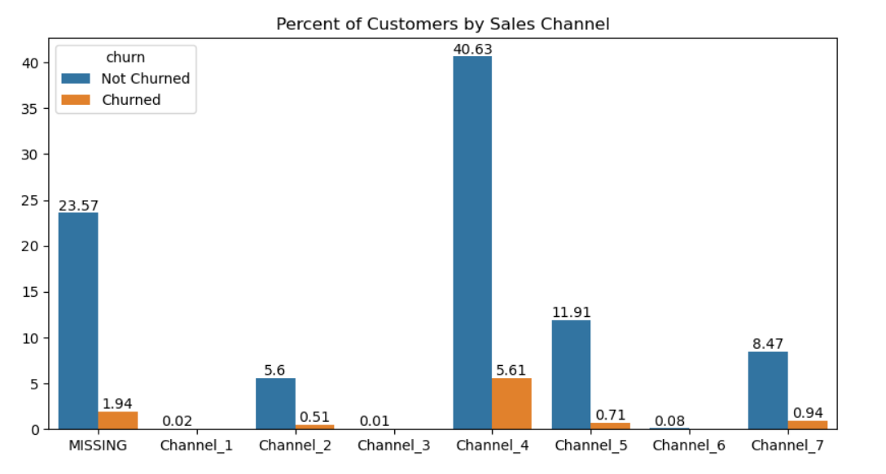

# Exploratory Data Analysis (BCG X Data Science Project Part 1)

## Introduction
This is Part 1 of a project from the [BCG X Data Science micro-internship](https://www.theforage.com/simulations/bcg/data-science-ccdz). The Boston Consulting Group (BCG) is an American global consulting firm that  partners with leaders in business and society to tackle their most important challenges. It is one of the world's 3 largest consulting firms along with McKinsey & Company and Bain & Company. BCG X is a new initiative from BCG that combines the firm's consulting expertise with tech building and design.

In this task, I take on the role of a junior data analyst employed at BCG X. BCG X's client, a major gas and electricity utility called PowerCo, is concerned about their customers leaving for better offers from other energy providers. **In this part of the project, I will conduct exploratory data analysis on the raw data to get a holistic understanding of the data.**

## Problem Statement
PowerCo has expressed concern over their customers leaving them for better offers from competing energy companies. This concern is exacerbated by the fact that the energy market has had a lot of change in recent years and there are more options than ever for customers to choose from. During a meeting with the Associate Director of the Data Science team, **one potential reason for churn is price sensitivity.** I am tasked with investigating this hypothesis. **To gain a holistic understanding of the data provided by PowerCo, my first task is to conduct exploratory data analysis.**

## Skills Demonstrated
* Python
* Exploratory Data Analysis
* Data Visualization
* Descriptive Statistics

## Data Sourcing
This data was provided to me by the BCG X Data Science micro-internship hosted by Forage. A copy of the data is included in this repository under the file name: client_data (1).csv and price_data (1).csv.

## Data Attributes
The data provided by PowerCo is separated into 2 files: client_data(1).csv and price_data(1).csv. The client data contains information about power consumption, sales channels, forecasted power consumption, and whether the client has churned or not. Each row contains data for 1 client.

The price data contains information on the price of energy that each client pays during various peak times of the day. Most clients will have 12 rows of data, one row for each month in a year.

Attributes for client data:
* id - Client company identifier.
* channel_sales - Code of the sales channel.
* cons_12m - Electricity consumption of the past 12 months.
* cons_gas_12m - Gas consumption of the past 12 months.
* cons_last_month - Electricity consumption of the last month.
* date_activ - Date of activation of the contract.
* date_end - Registered date of the end of the contract.
* date_modif_prod - Date of the last modification of the product.
* date_renewal - Date of the next contract renewal.
* forecast_cons_12m - FForecasted electricity consumption for next 12 months.
* forecast_cons_year - Forecasted electricity consumption for the next calendar year.
* forecast_discount_energy - Forecasted value of current discount.
* forecast_meter_rent_12m - Forecasted bill of meter rental for the next 2 months.
* forecast_price_energy_off_peak - Forecasted energy price for 1st period (off peak).
* forecast_price_energy_peak - Forecasted energy price for 2nd period (peak).
* forecast_price_pow_off_peak - Forecasted power price for 1st period (off peak).
* has_gas - Indicated if client is also a gas client.
* imp_cons - Current paid consumption.
* margin_gross_pow_ele - Gross margin on power subscription.
* margin_net_pow_ele - Net margin on power subscription.
* nb_prod_act - Number of active products and services.
* net_margin - Total net margin.
* num_years_antig - Antiquity of the client (in number of years).
* origin_up - Code of the electricity campaign the customer first subscribed to.
* pow_max - Subscribed power.
* churn - Has the client churned over the next 3 months.

Attributes for price data:
* id - Client company identifier.
* price_date - Reference date.
* price_off_peak_var - Price of energy for the 1st period (off peak).
* price_peak_var - Price of energy for the 2nd period (peak).
* price_mid_peak_var - Price of energy for the 3rd period (mid peak).
* price_off_peak_fix - Price of power for the 1st period (off peak).
* price_peak_fix - Price of power for the 2nd period (peak).
* price_mid_peak_fix - Price of power for the 3rd period (mid peak).

## Exploratory Data Analysis and Data Visualizations
**Exploratory data analysis is used to gain a holistic understanding of the data.
Exploratory data analysis uses statistical techniques and visualizations to gain a better understanding of the statistical properties that the data holds.**
A copy of this analysis is included in this repository under the file name: James Weber Exploratory Data Analysis.ipynb.

### 1. Importing Libraries and Data
To start with data analysis, we must first import libraries which contains the commands we need for analysis.
Then we import the data from the client_data(1).csv and price_data(1).csv files into dataframes.

```
# Importing libraries

import matplotlib.pyplot as plt
import seaborn as sns
import pandas as pd

# Use the read_csv() command to import .csv files.
# Create a client_df dataframe for the client data and a price_df dataframe for the price data.

client_df = pd.read_csv(r'C:/Users/jwebe/Desktop/client_data (1).csv')
price_df = pd.read_csv(r'C:/Users/jwebe/Desktop/price_data (1).csv')
```
<br/>

### 2. Descriptive Statistics for Client and Price Data
#### 2a. Client Data
Once we have both client and price data imported into dataframes, we can use the .describe() command to get descriptive statistics for client and price data.
**Descriptive statistics are statistics that summarizes and describes the main features of a dataset.**
This includes the the mean, standard deviation, min, max, and the 25% 50% and 75% quartiles for each column.

```
# Use the .describe() command to get the mean, standard deviation, min, max, and the 25% 50% and 75% quartiles of a dataframe.

client_df.describe()
```


**Based on the percentile values, we have a lot of highly skewed data.**
Skewed data occurs when most of the data points are to the right or left side of the mean value.


**Too much skewness degrades the model’s ability to describe typical cases because the model has to deal with rare cases on extreme values.**

#### 2b. Price Data
```
# Use the .describe() command to get the mean, standard deviation, min, max, and the 25% 50% and 75% quartiles of a dataframe.

client_df.describe()
```


Overall, the price data looks good.

### 3. Churn Data Visualization
**To fully analyze the data, we will need to create visualizations to determine if there are any patterns in the data that cannot be shown with statistics alone.** 
We can get an overall understanding of the churn rate (the percentage of customers who stop doing business with a company) by visualizin the data on a bar chart.

The code below is used to create a dataframe which will count the number of customers who have churned and the number of customers who will continue their business with PowerCo.
```
# Create a churn dataframe using the churn column.
# Use the .value_counts() command to count the number of unique values in the churn column.
# Use the .reset_index(name = 'churn_count') command to create a dataframe and reset the index.

client_churn_count = client_df['churn'].value_counts().reset_index(name = 'churn_count')

# Use the .astype(str) command to convert the churn column from int data type to string data type.
# Use the .replace() command to replace 0 with 'Not Churned' and 1 with 'Churned'.

client_churn_count['churn'] = client_churn_count['churn'].astype(str)
client_churn_count['churn'] = client_churn_count['churn'].replace('0', 
                                                                  'Not Churned')
client_churn_count['churn'] = client_churn_count['churn'].replace('1', 
                                                                  'Churned')
```
The code below will create a new column that will calculate the percentage of customers who have or have not churned.
```
# Calculate the total number of customers by using the .sum() command to sum all the values in the churn_count column.
# Create a column called churn_percent and calculate the percentage of customers who have churned and customers who have not churned.
# Use the .round(2) command to round the values in the churn_percent column to 2 decimal places.

total_churn = client_churn_count['churn_count'].sum()
client_churn_count['churn_percent'] = (client_churn_count['churn_count']/total_churn) * 100
client_churn_count['churn_percent'] = client_churn_count['churn_percent'].round(2)
```
The code below will create a bar chart using the dataframe that we created,
```
# Use the fig, ax = plt.subplots() command to create a set of subplots within one cell.

fig, ax = plt.subplots(1, 1, figsize=(5, 5))

# Use the sns.barplot() command to create a bar plot.

sns.barplot( 
            data = client_churn_count, 
            x = 'churn', 
            y = 'churn_percent').set(title = 'Percent of Customers Churned', 
                                     xlabel = None, 
                                     ylabel = None)

ax.bar_label(ax.containers[0])
```


The graph above depicts the number of customers who churned compared to the customers who are staying with PowerCo. **The percentage of customers who have churned is 9.72%. The ideal churn rate for an established business is approximately 5% to 7%. Although the churn rate for PowerCo is not bad, it could be improved.**

### 4. Churn Based on Sales Channels
Sales channels are methods or pathways businesses use to sells their product or service to customers. Examples of sales channels are retail, mobile apps, social media, and direct sales. **By determining the churn rate based on sales channels, we can gain some insight on the types of businesses that will stay with PowerCo or will leave PowerCo.**

The code below is used to create a dataframe which will group all of PowerCo's customers based on their sales channel. The code will then count the number of customers who have or have not churned for each group.
```
# Create a sales channel dataframe using the id, channel_sales, and churn columns.

s_channel = client_df[['id', 
                       'channel_sales', 
                       'churn']]

# Use the .grouby() command to group the data based on values in the channel_sales column.
# Use the .value_counts() command to count the number values in each group.
# Use the .reset_index(name = 'churn_count') command to create a dataframe and reset the index.

s_channel_churn_count = s_channel['churn'].groupby(s_channel['channel_sales']).value_counts().reset_index(name = 's_channel_churn_count
```
The sales channel data is encrypted for privacy. The code below is used to replace the encrypted sales channel with Channel_1, Channel_2, etc. for readability.
```
# The values in the channel_sales column are jumbled to protect the privacy of the company.
# Use the .replace() command to replace sales channel names with names that are more readable (Channel_1, Channel_2, etc.)

s_channel_churn_count['channel_sales'] = s_channel_churn_count['channel_sales'].replace('epumfxlbckeskwekxbiuasklxalciiuu', 
                                                                                        'Channel_1')
s_channel_churn_count['channel_sales'] = s_channel_churn_count['channel_sales'].replace('ewpakwlliwisiwduibdlfmalxowmwpci', 
                                                                                        'Channel_2')
s_channel_churn_count['channel_sales'] = s_channel_churn_count['channel_sales'].replace('fixdbufsefwooaasfcxdxadsiekoceaa', 
                                                                                        'Channel_3')
s_channel_churn_count['channel_sales'] = s_channel_churn_count['channel_sales'].replace('foosdfpfkusacimwkcsosbicdxkicaua', 
                                                                                        'Channel_4')
s_channel_churn_count['channel_sales'] = s_channel_churn_count['channel_sales'].replace('lmkebamcaaclubfxadlmueccxoimlema', 
                                                                                        'Channel_5')
s_channel_churn_count['channel_sales'] = s_channel_churn_count['channel_sales'].replace('sddiedcslfslkckwlfkdpoeeailfpeds', 
                                                                                        'Channel_6')
s_channel_churn_count['channel_sales'] = s_channel_churn_count['channel_sales'].replace('usilxuppasemubllopkaafesmlibmsdf', 
                                                                                        'Channel_7')
```
The next set of code is used to calculate the churn rate for each group.
```
# Create a column called s_channel_churn_percent and calculate the percentage of customers who have churned and customers who have not churned.
# Use the .round(2) command to round the values in the churn_percent column to 2 decimal places.
# To caculate churn percentage, use the total_churn variable that was calculated in the previous section.

s_channel_churn_count['s_channel_churn_percent'] = (s_channel_churn_count['s_channel_churn_count']/total_churn) * 100
s_channel_churn_count['s_channel_churn_percent'] = s_channel_churn_count['s_channel_churn_percent'].round(2)
```
The last set of code is used to create the bar chart with the dataframe we created.
```
# Use the fig, ax = plt.subplots() command to create a set of subplots within one cell.

fig, ax = plt.subplots(1, 1, figsize=(10, 5))

# Use the sns.barplot() command to create a bar plot.

sns.barplot( 
            data = s_channel_churn_count, 
            x = 'channel_sales', 
            y = 's_channel_churn_percent', 
            hue = 'churn', 
            errorbar = None).set(title = 'Percent of Customers by Sales Channel', 
                                 xlabel = None, 
                                 ylabel = None)

ax.bar_label(ax.containers[0])
ax.bar_label(ax.containers[1])
```


**Nearly half of PowerCo's customers use Sales Channel 4.** When compared to the total number of PowerCo's customers, 40.63% use Sales Channel 4 and are staying with PowerCo and 5.61% use Sales Channel 4 but have left PowerCo. **If PowerCo has an overall churn rate of 9.72%, then the churn rate of customers who use Sales Channel 4 (5.61%) would indicate that approximately 58% of customers who have left PowerCo use Sales Channel 4. When developing customer retention strategies, attention should be given to customers who use sales channel 4.**

The MISSING sales channel contains nearly a quarter of PowerCo's customers. However, the MISSING sales channel indicates missing data that was added during data cleaning. Further research is needed to determine what the missing data should be.

Channels 1, 3, and 6 do not have customer churn. All customers who use sales channels 1, 3, and 6 are staying with PowerCo. However, they make up a total of .11% of PowerCo's customers. There is not enough customers using  those 3 sales channel to accurately analyze how they affect churn.

### 5. Churn Based on Gas Usage
Some of PowerCo's customers use electric power only. Other customers use gas only or both electricity and gas. **There may be a pattern of churn based on whether or not customers use gas as a source of power.**

The code below is used to create a dataframe which will group all of PowerCo's customers based on whether they use gas or not. The code will then count the number of customers who have or have not churned for each group.
```
# Create a dataframe using the id, has_gas, and churn columns.

gas_usage = client_df[['id', 
                       'has_gas', 
                       'churn']]

# Use the .grouby() command to group the data based on values in the has_gas column.
# Use the .value_counts() command to count the number values in each group.
# Use the .reset_index(name = 'churn_count') command to create a dataframe and reset the index.

gas_usage_churn_count = gas_usage['churn'].groupby(gas_usage['has_gas']).value_counts().reset_index(name = 'gas_usage_churn_count')

# Use the .astype(str) command to convert the churn column from int data type to string data type.
# Use the .replace() command to replace one string value with another string value.

gas_usage_churn_count['churn'] = gas_usage_churn_count['churn'].astype(str)
gas_usage_churn_count['churn'] = gas_usage_churn_count['churn'].replace('0', 
                                                                        'Not Churned')
gas_usage_churn_count['churn'] = gas_usage_churn_count['churn'].replace('1', 
                                                                        'Churned')
gas_usage_churn_count['has_gas'] = gas_usage_churn_count['has_gas'].replace('f', 
                                                                            'No Gas')
gas_usage_churn_count['has_gas'] = gas_usage_churn_count['has_gas'].replace('t', 
                                                                            'Uses Gas')
```
The next set of code is used to calculate the churn rate for each group.
```
# Create a column called gas_usage_churn_percent and calculate the percentage of customers who have churned and customers who have not churned.
# Use the .round(2) command to round the values in the churn_percent column to 2 decimal places.
# To caculate churn percentage, use the total_churn variable that was calculated in the previous section.

gas_usage_churn_count['gas_usage_churn_percent'] = (gas_usage_churn_count['gas_usage_churn_count']/total_churn) * 100
gas_usage_churn_count['gas_usage_churn_percent'] = gas_usage_churn_count['gas_usage_churn_percent'].round(2)
```
The last group of code is used to create a bar chart with the dataframe we created.
```
# Use the fig, ax = plt.subplots() command to create a set of subplots within one cell.

fig, ax = plt.subplots(1, 1, figsize=(5, 5))

# Use the sns.barplot() command to create a bar plot.

sns.barplot( 
            data = gas_usage_churn_count, 
            x = 'has_gas', 
            y = 'gas_usage_churn_percent', 
            hue = 'churn', 
            errorbar = None).set(title = 'Percent of Customers by Sales Channel', 
                                 xlabel = None, 
                                 ylabel = None)

ax.bar_label(ax.containers[0])
ax.bar_label(ax.containers[1])
```


**Over 80% of PowerCo customers do not use gas.** Approximately 8% of PowerCo customers do not use gas and have churned. **If the overall churn rate for PowerCo is 9.72%, the churn rate for customers who do not use gas (8.23%) indicates that approximately 85% of customers who have churned do not use gas. Retention strategies should prioritize customers who do not use gas.**

### 6. Power Consumption Data Distribution
In section 2a, we discovered that several columns in the client_df dataframe contain skewed data. Let's create visualizations of the power consumption data to visualize the skew. Power consumption data includes the cons_12m, cons_gas_12m, cons_last_month, and imp_cons columns.

The code below is used to create histograms of the 4 columns that contain power consumpion data. In a histogram, each bar represents a range of values. The x axis represents the data value and the y axis represents the number of times the value shows up in the dataset. The taller the bar, the more often a range of values appear in the data.
```
# Use the fig, ax = plt.subplots() command to create a set of subplots within one cell.

fig, axs = plt.subplots(4, 1, figsize=(8,25))

# Use the histlot() command to create box plots to see how the data is distributed.

sns.histplot(client_df['cons_12m'].dropna(), 
             kde = True, 
             ax = axs[0]).set(title = '12 Month Electricity Consumption Data Distribution')

sns.histplot(client_df[client_df['has_gas'] == 't']['cons_gas_12m'].dropna(), 
             kde = True, 
             ax = axs[1]).set(title = '12 Month Gas Consumption Data Distribution')

sns.histplot(client_df['cons_last_month'].dropna(), 
             kde = True, 
             ax = axs[2]).set(title = 'Last Month Electricity Consumption Bata Distribution')

sns.histplot(client_df['imp_cons'].dropna(), 
             kde = True, 
             ax = axs[3]).set(title = 'Current Paid Consumption Data Distribution')
```


**The histograms for all 4 columns show that energy consumption data are highly, postiviely skewed.** The majority of the data fall on the left side of the histograms and there are outliers on the right side. The outliers are the cause of the very long right tail. **Heavily skewed data can compromise the accuracy of the machine learning model. We will address the skewed data in part 2 of the project.**

### 7. Forecast Data Distribution
Forecast data are estimates of future power consumption for each customer. Similar to energy consumption, we will create histograms to visualize the data's skewness. Columns that contain forecast data are forecast_cons_12m, forecast_cons_year, forecast_discount_energy, forecast_meter_rent_12m, forecast_price_energy_off_peak, forecast_price_energy_peak, and forecast_price_pow_off_peak.

The code blelow is used to create histograms of the 7 columns that contain power consumpion data.
```
# Use the fig, ax = plt.subplots() command to create a set of subplots within one cell.

fig, axs = plt.subplots(7, 1, figsize=(8,45))

# Use the boxplot() command to create box plots to see how the data is distributed.

sns.histplot(client_df['forecast_cons_12m'].dropna(), 
             kde = True, 
             ax = axs[0]).set(title = 'Forecasted 12 Month Electricity Consumption Data Distribution')

sns.histplot(client_df['forecast_cons_year'].dropna(), 
             kde = True, 
             ax = axs[1]).set(title = 'Forecasted Next Calendar Year Electricity Consumption Data Distribution')

sns.histplot(client_df['forecast_discount_energy'].dropna(), 
             kde = True, 
             ax = axs[2]).set(title = 'Forecasted Value of Current Discount Data Distribution')

sns.histplot(client_df['forecast_meter_rent_12m'].dropna(), 
             kde = True, 
             ax = axs[3]).set(title = 'Forecasted 2 Month Bill of Meter Rental Data Distribution')

sns.histplot(client_df['forecast_price_energy_off_peak'].dropna(), 
             kde = True, 
             ax = axs[4]).set(title = 'Forecasted Energy Price for Off Peak Hours Data Distribution')

sns.histplot(client_df['forecast_price_energy_peak'].dropna(), 
             kde = True, 
             ax = axs[5]).set(title = 'Forecasted Energy Price for Peak Hours Data Distribution')

sns.histplot(client_df['forecast_price_pow_off_peak'].dropna(), 
             kde = True, 
             ax = axs[6]).set(title = 'Forecasted Power Price for Off Peak Hours Data Distribution')
```


**The first 3 histograms show highly, positively skewed data. The last 4 histograms show multimodal distribution.** Multimodal distribution occurs when there are more than 1 peak in the distribution of data. **One explanation of for multimodal distribution is that there are muultiple groups in the data.** The peaks represent the mode (the most commonly occuring value) for each group. **Further research is recommended to determine what groups are located in the data containing multimodal distribution.**

## Findings and Conclusion
After conducting exploratory data analysis on PowerCo's client data, we have made the following discoveries:
* PowerCo's churn rate is 9.7%. The ideal churn rate is 5%-7% and there is room for PowerCo's churn rate to improve.
* Approximately 58% of PowerCo's customers who have churned utilize sales channel 4. 
* Approximately 85% of PowerCo's customers who have churned do not use gas.
* When developing a retention strategy, focus should be given towards customers who use sales channel 4, do not use gas, or both.
* Several columns that contain power consumption data and forecast data contain highly skewed data. In part 2, we will tranform the data to deal with the skew.
* Several columns containing forecast data have multimodal distribution. This indicates that there are more than 1 groups within each column. Further research is recommended to determine these groups.

In part 2 of this project, we will conduct feature engineering, which involves the transformation, removal, and creation of new features.
